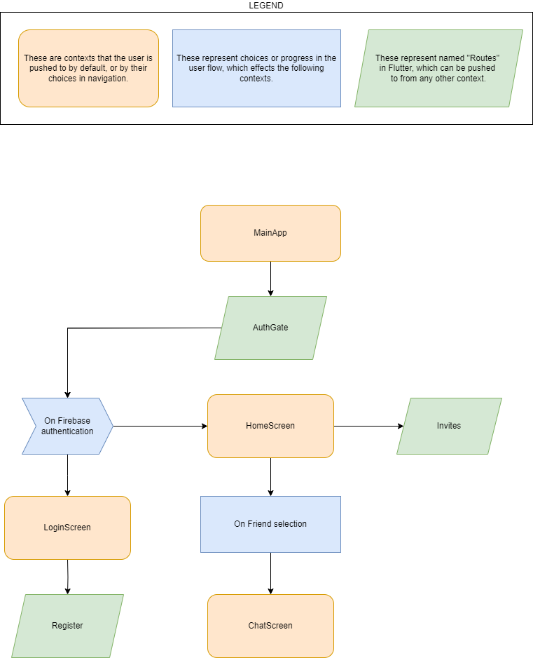
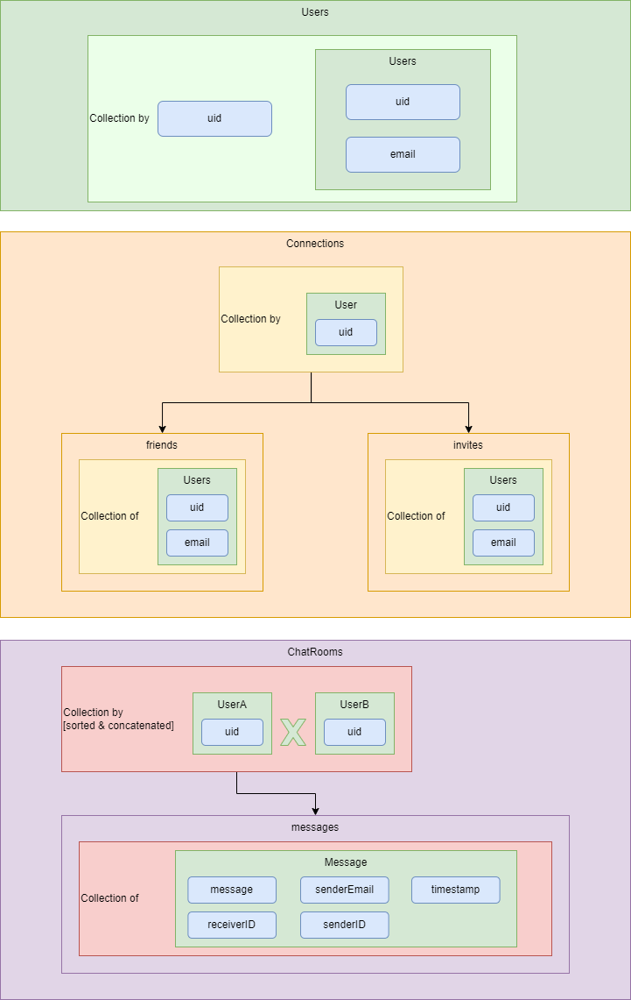

# Overview 

The technology choices, which will be explained below, are: 
- Flutter & Dart language 
- Firebase 

## Flutter 
Flutter is a modern crossplatform framework which leverages native tools on a variety of platforms to create a unified experience. 

It has a simple build toolchain, package manager and debugging tools. 

It has a high level of accessibility - layout configuration is Dart code, with no intermediary systems, 
schema or apps such as XAML or QtDesigner. 

Performance is about at parity with a platform like React, which is suitable for this solution. 

## Dart 
Dart is a requirement for using the Flutter framework; other than that, it's an unremarkable language. 

One point of note, in choosing both Dart and Flutter, is the maintainability of Dart's strong static typing.

Due to it's minimal usage, there is a tradeoff in wide availability of Dart knowledge in the job market but I am the sole forseeable owner of this project. 

## Firebase 
Firebase is the de facto Google platform for providing services to Flutter apps. As such, it's a natural choice for this app. 

It is a cloud technology, which should scale well; rather than using lower level tools like TCP or websockets. 

Given a sufficient scale, the structures used for data storage would need to be reengineered to provide better data integrity, performance and robustness. 

# Structure 

For the UI, I opted to keep it as simple as possible; after authentication, the home screen provides access to inviting friends, checking your invites and chatting with friends. The chat screen relies on navigator context rather than being on it's own "route"; this is a deliberate limitation on complexity, though could be changed later to allow for a push notification action to direct you to a target chat location. 

For the backend, I used three main tables: Users, Connections and ChatRooms. 
- Users are kept in a collection by their own uid, and only retain uid and email information. 
- Chatrooms are kept in a collection identified by the combined uids of the two users to whom the chatroom pertains, and stores messages.
- Connections are kept in several collections, sorted by user uid; each one contains a collection of friends and invites. Data is doubled up here for convenience - email is stored in all cases to reduce the number of queries required; a solution more concerned with data integrity could remove this. Due to the structure of the collections used, it's technically possible for there to be a double up of friends or invites, but this is naively validated at the UI level; a more robust solution would ensure that the collections could never become malformed with doubled up data. 

_Diagrams created with https://app.diagrams.net/_